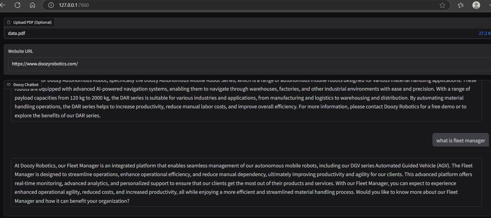

# Rag_With_Both_webscrape_and_pdf
Rag application

# requirement
1.python 3.12

#dependency install

pip install torch --index-url https://download.pytorch.org/whl/cpu 

pip install -r requirements.txt

# run application
open terminal or cmd 
python run.py (run this where run.py file is located) 

# open application 
go to this ip address http://127.0.0.1:7860/ applciation running

#upload data.pdf and for webscrape i used this  https://www.doozyrobotics.com/ 
#sample output 

